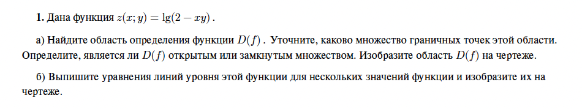
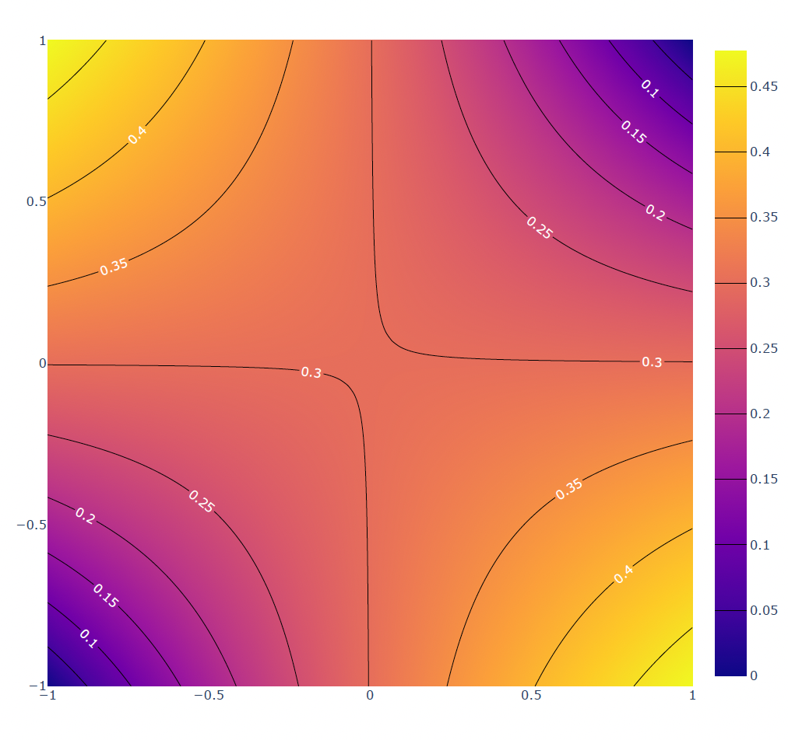
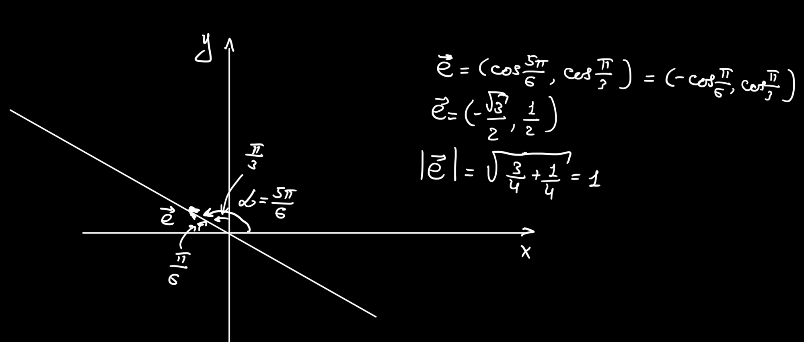

*Eduard Ursov*
# Семинар 1. Функции нескольких переменных

Первая большая тема этого семестра — функции нескольких переменных.

Если в случае одномерного анализа функция $f(x)$ зависела только от одной переменной $x$, определенной в некой области действительных чисел $X$ ($x \in X$), где $X$ *вложено* в $\Re$ ($X \subseteq \Re$), то в случае увеличения размерности наша функция уже начинает зависеть от нескольких переменных $x_1, x_2, ..., x_m$: $u = f(x_1, x_2, ..., x_m)$. Упорядоченная совокупность чисел $(x_1, x_2, ..., x_m)$ является точкой в $n$-мерном координатном пространстве $E^m$ ($m$-пространство, в котором определено понятие *расстояния* между двумя любыми точками), числа же называются координатой точки в $n$-мерном пространстве. Будем обозначать точку вот так: $M(x_1, x_2, ..., x_m)$.

  

>***Определение 1***. Пусть $\{M\}$ - множество точке в пространстве $E^m$. Если каждой точке $M \in \{M\}$ поставлено в соответствие некоторое число $u$, то говорят, что определена функция $u = f(M)$ или $u = f(x_1, x_2, ..., x_m)$ на множестве $\{M\}$. $\{M\}$ называется *областью определения* функции $f(M)$ и обозначают как $D(f)$. Совокупность значений функции $\{u\}$ называется *областью значений* функции $f(M)$.

  

***Замечание.*** В реальной жизни функции многих переменных встречаются гораздо чаще функций одной переменной. Мы живем в трехмерном (+ время) пространстве; функция температуры зависит не только от времени дня, но и от сезона, широты и т.д.; стоимость акции компании Apple зависит не только от их уровня продаж, но и от имиджа компании, психологии масс хомячков на рынке и политической ситуации в мире.

  

Многомерный анализ в точности повторяет все теоремы пределов, последовательностей и прочей базовой теории одномерного анализа. Подробности будут появляться по мере необходимости, также всю теорию можно найти в приложении.

  

## Облаcти определения и линии уровня

  

Перейдем к первому мини-разделу. Здесь нам понадобится еще несколько определений:

  

>***Определение 2***. Точка $A$ называется *внутренней точкой* множества $\{M\}$, если существует сколь угодно малая область, содержащая точку $A$ и принадлежащая множеству.

  

>***Определение 3***. Точка $A$ называется *граничной точкой* множества $\{M\}$, если какую бы малую область, содержащая точку $A$, вы бы ни выбрали, выбранная область все равно будет частично выходить за пределы множества $\{M\}$. Граничная точка может как принадлежать множеству, так и не принадлежать.

  

>***Определение 4***. Множество называется $\{M\}$ называется *ограниченным*, если все его точки содержатся в некотором шаре. Что такое шар в многомерном пространстве, додумайте сами С:

  

>***Определение 5***. Множество называется $\{M\}$ называется *открытым*, если все его точки внутренние. Иными словами, если граничных точек в этом множестве нет.

  

>***Определение 6***. Множество называется $\{M\}$ называется замкнутым, если оно содержит все свои граничные точки.

  

>***Определение 7***. *Линией уровня* функции называется уравнение $$u = f(x_1, x_2, ..., x_m) = c,$$ где $c$ — произвольное число.

  

Линий уровня бесконечно много, и через каждую точку области определения можно провести линию уровня. Линии уровня легко понять, если вспомнить, как на различных картах отмечается высота рельефа:

  
![[gorizont3.gif|300]]

  
Непрерывные линии показывают, где высота имеет одну и ту же величину. И все это на двумерной плоскости! Здесь высота является функцией широты и долготы: $h = h(x,y)$.

Приступим теперь к первому заданию.

### Задание 1

Первый пункт. Область определения ищется точно так же, как и в одномерном анализе. Смотрим, какие ограничения есть у функции. Ограничение лишь одно — аргумент логарифма не может быть отрицательным или равным нулю:

$$D(f) = \{x,y: 2-xy > 0\}.$$

Множеством граничных точек этой области будет множество всех точек, удовлетворяющих уравнению

$$2-xy = 0.$$

Иными словами, это множество является обычной гиперболой $y = \frac{2}{x}$. Из-за *строгого* неравенства в области определения множество граничных точек не принадлежит области определения, поэтому область определения является *открытым* множеством. Сама же область определения — это просто пространство *между* двумя ветками гиперболы.

  

Второй пункт. Линии уровня рисуются следующим образом. У нас есть уравнение линий уровня:

$$\lg(2 - xy) = c$$

В качестве $c$ выбираем несколько различных чисел и рисуем график полученной функции, например, $\lg(2 - xy) = 1$. Вот что получается:

  

  

На линиях уровня указаны соответствующие им значения $c$. По сути, это и есть значение искомой функции, которое оно не изменяет вдоль какой-то линии.

  

## Частные производные (ЧП)

  

Идем дальше.

  

Пусть $M(x_1, x_2, ..., x_m)$ — внутренняя точка области определения функции $u = f(x_1,x_2,...,x_m)$. Рассмотрим *частное* *приращение* этой функции в точке $M$ по аргументу $x_k$ после приращения этого аргумента на $\Delta x_k$:

$$
\begin{align}
\Delta_{x_k}u=f(x_1,...,x_{k-1}, x_{k} + \Delta x_k, x_{k+1},...,x_m)\\ - f(x_1,...,x_{k-1}, x_{k}, x_{k+1},...,x_m)
\end{align}
$$

  

>***Определение 8***. *Частной производной* (ЧП) функции $u = f(x_1,x_2,...,x_m)$ по *аргументу $x_k$* в точке $M$ называется $$\lim_{\Delta x_k \rightarrow 0} \frac{\Delta_{x_k}u (M)}{\Delta {x_k}}$$

  

В случае функции двух переменных $z = f(x,y)$ ЧП по $x$ и $y$ обозначаются так:

$$
\frac{\partial z}{\partial x}(M) \text{ и } \frac{\partial z}{\partial y}(M).
$$

***Замечание***. Чтобы найти ЧП функции по какой-то переменной, надо *зафиксировать* все остальные переменные (т.е. сделать вид, что они постоянные величины) и найти производную так, как это делают с функцией одной переменной.

  

>***Определение 9***. *Первым дифференциалом* функции $u = f(x_1,x_2,...,x_m)$ в точке $M$ называется следующее выражение: $$ du = \frac{\partial u}{\partial x_1}(M)dx_1 + ...+ \frac{\partial u}{\partial x_m}(M)dx_m $$

  

В случае двух переменных $x,y$: $$ dz = \frac{\partial z}{\partial x}(M)dx + \frac{\partial z}{\partial y}(M)dy $$

  

Любая задача на поиск дифференциала является всего лишь задачей на поиск всех ЧП функции.

  

>***Определение 10***. *ЧП второго порядка* называется ЧП от ЧП первого порядка (no way...).

  

Это значит, что мы можем взять сначала ЧП по одной переменной, а затем по другой, или дважды по одной. В первом случае вторая ЧП обозначается вот так и называется *смешанной*:

$$
\frac{\partial^2 u}{\partial x_k \partial x_l}(M)
$$

Во втором случае вот так:

$$
\frac{\partial^2 u}{\partial x_k^2}(M)
$$

  

Интересно, а, например, $\frac{\partial^2 u}{\partial x_k \partial x_l}(M) = \frac{\partial^2 u}{\partial x_l \partial x_k}(M)$? Равны ли вторые производные, которые взяты в разных порядках?

  

>***Теорема (о равенстве смешанных производных)***: Достаточным условием равенства смешанных производных функции в некоторой окрестности точки является их непрерывность.

Получается, что в большинстве задач мы можем почти не волноваться о том, в каком порядке брать производные, разницы не будет.

>***Определение 9***. *Вторым дифференциалом* функции $z = f(x,y)$ (ввиду экономии бумаги и нервов запишем для функции двух переменных) в точке $M(x,y)$ называется следующее выражение: $$d^2z|_{M} = 
\frac{\partial^2 z}{\partial x^2}(M)dx^2 + 2
\frac{\partial^2 z}{\partial x \partial y}(M)dxdy + \frac{\partial^2 z}{\partial x^2}(M)dy^2 $$

Итого, чтобы найти второй дифференциал, нужно найти вторые ЧП функции.

### Задание 2

*Найдите первый и второй дифференциалы функции $f(x; y) = 2x^3 - 4x^2y - 4y - 5$ в точке $A(2;-1)$ .*

1. Сначала ищем ЧП первого порядка (фиксируем переменные, по которым не дифференцируем!): 
$$
\begin{align}
\frac{\partial f(x,y)}{\partial x} = 6x^2 - 8xy, \\
\frac{\partial f(x,y)}{\partial y} = -4x^2 - 4.
\end{align}
$$
2. Получаем формулу для дифференциала первого порядка:
$$
df = (6x^2 - 8xy)dx + (-4x^2 - 4)dy. 
$$
3. Теперь находим $df$ в точке $A(2;-1)$:
$$
df|_{A(2;-1)} = (6 \cdot 2^2 - 8\cdot 2 \cdot (-1))dx + (-4\cdot 2^2 - 4)dy = 40dx - 20dy. 
$$
4.  Находим ЧП второго порядка:
$$
\begin{align}
\frac{\partial^2 f(x,y)}{\partial x^2} = 12x - 8y, \\
\frac{\partial^2 f(x,y)}{\partial y^2} = 0, \\
\frac{\partial^2 f(x,y)}{\partial x \partial y} = -8x.
\end{align}
$$
5. Получаем формулу для дифференциала второго порядка:
$$
d^2 f = (12x - 8y)dx^2 + (-8x) dxdy + 0 \cdot dy^2 = (12x - 8y)dx^2 + (-8x) dxdy. 
$$
6. Теперь находим $d^2 f$ в точке $A(2;-1)$:
$$
d^2 f|_{A(2;-1)} = (12\cdot 2 - 8\cdot (-1))dx^2 -8\cdot 1\cdot dxdy = 32dx^2 - 8dxdy. 
$$
Вот и все.

### Задание 4
*Найдите первый и второй дифференциалы функции $f(x; y) = \sin(4xy)$ в точке $A(1;\frac{1}{2}\pi)$ .*

Тут все аналогично, так что просто посмотрим, как вычисляются ЧП для такой функции:
$$
\begin{align}
\frac{\partial f(x,y)}{\partial x} = 4y\cos(4xy), \\
\frac{\partial f(x,y)}{\partial y} = 4x\cos(4xy).
\end{align}
$$

В каждом случае любой коэффициент, в котором нет переменной, по которой берется производной, считается константой, а значит, производная берется как обычная сложная функция одной переменной.

## Производные по направлению

Как мы помним, производная показывает скорость изменения функции в данной точке. ЧП же показывает скорость изменения функции при изменении переменной, по которой идет дифференцирование. Теперь зададимся таким вопросом: что, если мне надо найти то, как ведет себя функция (возрастает или убывает) при движении вдоль определенного направления? Для решения такой задачи используют производные по направлению.

Пусть мы имеем *вектор* $\vec l = (l_x,l_y)$ в двумерном пространстве, вдоль которого мы хотим узнать информацию об изменении функции $z = f(x,y)$. Этот вектор находится в плоскости XOY,  мы же двигаемся вдоль направления этого вектора, начиная с точки $M$, в которой нам и нужно найти производную по направлению. Определим также единичный вектор, коллинеарный (т.е. сонаправленный) вектору $\vec l$: $\vec e = \frac{\vec l}{|\vec l|}$. Производную по направлению будем вычислять следующим образом (формальное определение находится в прилагаемой литературе):
$$
\frac{\partial z(M)}{\partial \vec e} = \frac{\partial z(M)}{\partial x}e_x + \frac{\partial z(M)}{\partial y}e_y.
$$

Для удобства введем еще одно определение.

>***Определение 9***. Градиентом функции $z = f(x,y)$ в точке $M(x,y)$ называется вектор: $$\\grad z|_{M(x,y)} = (\frac{\partial z(M)}{\partial x}; \frac{\partial z(M)}{\partial y})$$

Градиент показывает направление наибольшего роста функции в данной точке. Тогда можно заметить, что производная по направлению можно переписать в виде скалярного произведения двух векторов:
$$
\frac{\partial z(M)}{\partial \vec e} = \\grad z|_{M(x,y)} \cdot \vec e.
$$

### Задание 7
*Найдите производную функции $f(x; y) = -y^2 - 4xy^2 - 4x^4$ в точке $A(-2; 2)$ в направлении, составляющем угол $\alpha = 5\pi/6$ с положительным направлением оси $Ox$.*

Чтобы найти производную по направлению, необходимо, прежде всего, найти то самое направление, по которому мы ищем производную. То есть нам необходимо найти единичный вектор, составляющий угол $\alpha = 5\pi/6$ с положительным направлением оси $Ox$. Рисуем чертеж с указанием всех углов и используем понятие *направляющих косинусов*:

Теперь находим ЧП:
$$
\begin{align}
\frac{\partial f(x,y)}{\partial x} = -4y^2 - 16x^3, \\
\frac{\partial f(x,y)}{\partial y} = -2y - 8xy.
\end{align}
$$
Находим ЧП в точке $A(-2; 2)$:
$$
\begin{align}
\frac{\partial f(x,y)}{\partial x}|_{A(-2;2)} = -4\cdot 2^2 - 16\cdot (-2)^3 = -16 + 128 = 112, \\
\frac{\partial f(x,y)}{\partial y}|_{A(-2;2)} = -2y - 8xy = -2\cdot 2 - 8\cdot (-2) \cdot 2 = -4 + 32 = 28.
\end{align}
$$
Теперь все подставляем в формулу для производной по направлению:
$$
\frac{\partial f}{\partial \vec e}|_{A(-2;2)} = \frac{\partial f(A)}{\partial x}e_x + \frac{\partial z(A)}{\partial y}e_y = 112\cdot (-\frac{\sqrt{3}}{2}) + 28 \cdot \frac{1}{2} = -56\sqrt{3} + 14 = 14(-4\sqrt{3} + 1).
$$
Дополнительно запишем градиент функции в точке $A$ в явном виде:
$$
\\grad f|_{A(-2,2)}= (112, 28).
$$
## Полезная литература и ссылки
1. [Ссылка на код с визуализацией](https://nbviewer.org/github/eduard322/FA_calc/blob/main/code/Sem_1.ipynb)
2. [Mathprofi](http://mathprofi.ru/chastnye_proizvodnye_primery.html)
3. [Линии уровня](https://lms2.sseu.ru/courses/eresmat/course1/razd12z1/par12_1z1.htm)
4. _Математический анализ в вопросах и задачах_, Бутузов В.Ф., Крутицкая Н.Ч., Медведев Г.Н., Шишкин А.А.
