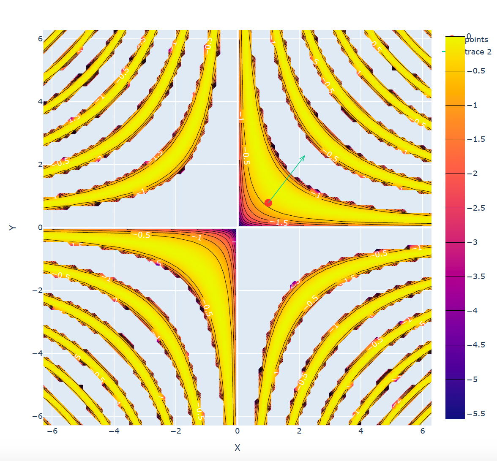
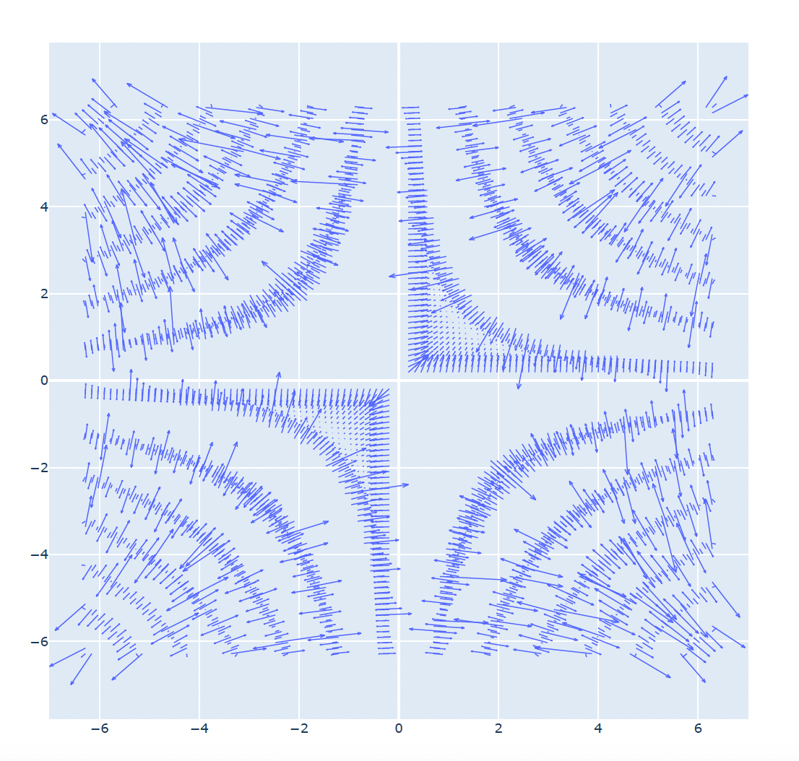
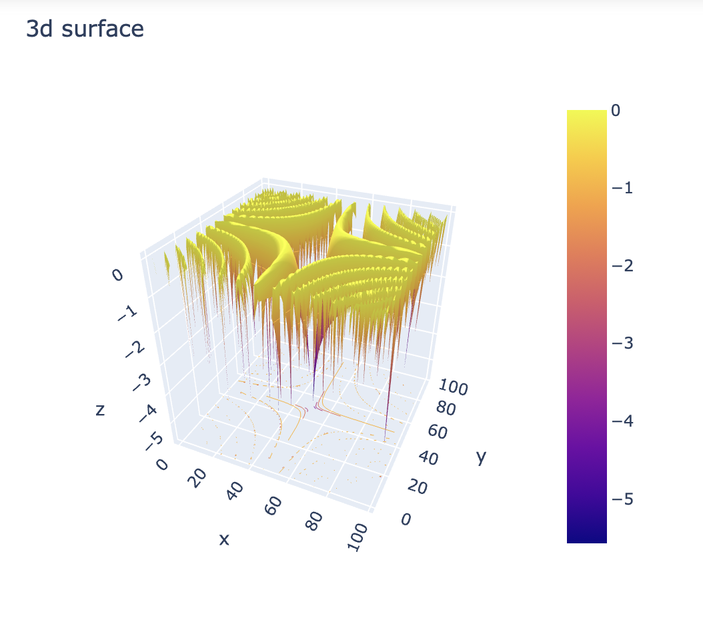

*Eduard Ursov* 
# Градиент, производная по направлению
Из прошлого семинара:
Пусть мы имеем *вектор* $\vec l = (l_x,l_y)$ в двумерном пространстве, вдоль которого мы хотим узнать информацию об изменении функции $z = f(x,y)$. Этот вектор находится в плоскости XOY,  мы же двигаемся вдоль направления этого вектора, начиная с точки $M$, в которой нам и нужно найти производную по направлению. Определим также единичный вектор, коллинеарный (т.е. сонаправленный) вектору $\vec l$: $\vec e = \frac{\vec l}{|\vec l|}$. Производную по направлению будем вычислять следующим образом (формальное определение находится в прилагаемой литературе):
$$
\frac{\partial z(M)}{\partial \vec e} = \frac{\partial z(M)}{\partial x}e_x + \frac{\partial z(M)}{\partial y}e_y.
$$

Для удобства введем еще одно определение.

>***Определение 9***. Градиентом функции $z = f(x,y)$ в точке $M(x,y)$ называется вектор: $$\\grad z|_{M(x,y)} = (\frac{\partial z(M)}{\partial x}; \frac{\partial z(M)}{\partial y})$$

**Градиент показывает направление наибольшего роста функции в данной точке**. Длина градиента показывает скорость роста функции. Тогда можно заметить, что производная по направлению можно переписать в виде скалярного произведения двух векторов:
$$
\frac{\partial z(M)}{\partial \vec e} = \\grad z|_{M(x,y)} \cdot \vec e.
$$

Здесь "точка" означает скалярное произведение двух векторов. Введем самое простое определение скалярного произведения. 
>***Определение 10***. В $m$-евклидовом пространстве  скалярное произведение векторов $\vec{a} =(a_1,a_2,..., a_m)$ и $\vec b = (b_1,b_2,...,b_m)$ определяется следующим выражением: $$ \vec{a}\cdot\vec{b} = a_1\cdot b_1 + a_2\cdot b_2 + ... +a_m\cdot b_m$$

Получается, что мы просто суммируем произведения соответсвующих координат векторов. Потренируемся находить градиенты и производные по направлению.

## Задание 8
Найдите производную функции $f(x; y) = 4xy - 4y^3 + 2y^4$ в точке $A(-2;−1)$ в направлении вектора $\vec v = (-5;-6)$.

1) Первый шаг всегда одинаковый. Находим направление, вдоль которого нам нужно найти производную. Под направлением мы понимаем *единичный* вектор. Нам сказано найти производную по направлению $\vec v = (-5;-6)$, значит, первым шагом нужно будет найти коллинеарный (то есть сонаправленный) ему вектор $\vec e$:
$$
\vec e = \frac{\vec l}{|\vec l|} = \frac{\vec l}{\sqrt{(-5)^2 + (-6)^2}} = (-5/\sqrt{61}, -6/\sqrt{61}).
$$
2) Дальше находим ЧП функции $f(x;y)$:
$$
\begin{align}
\frac{\partial f(x,y)}{\partial x} = 4y, \\
\frac{\partial f(x,y)}{\partial y} = 4x - 12y^2 + 8y^3.
\end{align}
$$
3. Находим градиент функции $f(x;y)$ в точке $A(-2;-1)$:
$$
\begin{align}
\\grad f|_{A(-2;-1)}= (4y, 4x - 12y^2 + 8y^3)|_{A(-2;-1)} = \\
=(-4;-8 - 12\cdot (-1)^2 + 8\cdot (-1)^3) = (-4;-28).
\end{align}
$$
4. Дополнительно найдем длину градиента:
$$
|\\grad f|_{A(-2;-1)}|= \sqrt{(-4)^2 + (-28)^2}=\sqrt{(-4)^2 + (-28)^2} = \sqrt{800} = 20\sqrt{2}.
$$
5. Находим производную по направлению:
$$
\frac{\partial f(x;y)}{\partial \vec e}|_{A(-2;-1)} = \\grad f|_{A(-2;-1)} \cdot \vec e = -4\cdot (-5/\sqrt{61}) - 28 \cdot (-6/\sqrt{61}) = 188/\sqrt{61}.
$$

## Доп задание
Найдите производную функции $f(x; y) = \ln{(\sin xy)}$ в точке $A(1;\pi/4)$ в направлении вектора $\vec v = (-1;0)$.
1. Вектор $\vec v = (-1;0)$ уже является единичным, значит, идем дальше.
2. Находим ЧП функции $f(x;y)$ (производная по внешней функции (логарифмы) на производную от внутренней функции (синусу)):
$$
\begin{align}
\frac{\partial f(x,y)}{\partial x} = \frac{1}{\sin{xy}}\cdot \frac{\partial \sin{xy}}{\partial x} = \frac{y\cos{xy}}{\sin{xy}} = y\cot{xy}, \\
\frac{\partial f(x,y)}{\partial y} = \frac{1}{\sin{xy}}\cdot \frac{\partial \sin{xy}}{\partial y} = \frac{x\cos{xy}}{\sin{xy}} = x\cot{xy}.
\end{align}
$$
3. Находим градиент функции $f(x;y)$ в точке $A(-2;-1)$:
$$
\begin{align}
\\grad f|_{A(1;\pi/4)}= (y\cot{xy}, x\cot{xy})|_{A(1;\pi/4)} = \\
= \cot{xy}\cdot (y, x)|_{A(1;\pi/4)} =  \cot{\pi/4}\cdot (\pi/4, 1) = (\pi/4, 1).
\end{align}
$$
4. Дополнительно найдем длину градиента:
$$
|\\grad f|_{A(1;\pi/4)}|= \sqrt{(\pi/4)^2 + (1)^2}=\sqrt{\pi^2/16 + 1}.
$$
5. Находим производную по направлению:
$$
\frac{\partial f(x;y)}{\partial \vec v}|_{A(1;\pi/4)} = \\grad f|_{A(1;\pi/4)} \cdot \vec v = \pi/4\cdot (-1) + 1 \cdot 0 = -\pi/4.
$$

Сделаем визуализацию линий уровня этого графика и нарисуем на нем вектор градиента: 

Видно, что градиент действительно показывает направление повышения уровня. Нарисуем также все поле градиентов в заданной области:

Сам же график выглядит так и точно соответсвует нарисованным линиям уровня:

# Локальный экстремум функции нескольких переменных
>***Теорема. Необходимое условие экстремума***. Если функция $f(x;y)$ имеет в точке $M_0(x_0,y_0)$ экстремум, то дифференциал функции в этой точке равен нулю: $$ df|_{M_0} = \frac{\partial f}{\partial x}(M_0)dx + \frac{\partial f}{\partial y}(M_0)dy =0 $$.

Если функция имеет в точке нулевой дифференциал, это не значит, что в этой точке функция имеет максимум/минимум. Назовем точки, при которых дифференциал зануляется, точками *возможного экстремума*. Чтобы такая точка стала действительно экстремумом, нужно от нее потребовать дополнительное условие (точно так же, как и в случае функции одной переменной мы требовали, чтобы слева и справа от точки производная имела разный знак):
>***Теорема. Достаточное условие экстремума***. Пусть функция $f(x;y)$ дифференцируема в окрестности точки $M_0(x_0,y_0)$ и дважды дифференцируема в самой точке $M_0(x_0,y_0)$, причем $df|_{M_0} = 0$ (т.е. $M_0$ является точкой возможного экстремума). Введем следующие обозначения: $$ \frac{\partial^2 f}{\partial x^2}(M_0) = a_{11}, \frac{\partial^2 f}{\partial x \partial y}(M_0) = a_{12}, \frac{\partial^2 f}{\partial y^2}(M_0) = a_{22}.$$
>Тогда:
>1. Если $D = a_{11}a_{22} - a_{12}^2  > 0$, то в точке $M_0$ функция имеет локальный экстремум (при $a_{11} < 0$ имеет локальный максимум, при  $a_{11} > 0$ локальный минимум).
>2. Если $D = a_{11}a_{22} - a_{12}^2  < 0$, то в точке $M_0$ функция не имеет локального экстремума.
>3. Если $D = a_{11}a_{22} - a_{12}^2  = 0$, то в точке $M_0$ функция может иметь локальный экстремум, а может и не иметь.

В формулировке теоремы виден сам алгоритм поиска локального экстремума. Сначала ищем точки возможных локальных экстремумов, затем ищем ЧП второго порядка в этих точках и проверяем знак $D$. 

## Задание 17
Найдите точки локальных экстремумов функции $f(x;y) =  \frac{36}{x} + \frac{3}{y} + x + 3y + 4$, лежащие в области $G = \{(x; y)|x > 0, y > 0\}$, и определите их вид.

1. Находим частные производные функции $f(x;y)$ и приравниваем их к нулю:
$$
\begin{align}
\frac{\partial f(x,y)}{\partial x} = -\frac{36}{x^2} + 1 = 0, \\
\frac{\partial f(x,y)}{\partial y} = -\frac{3}{y^2} + 3 = 0.
\end{align}
$$
2. Решаем получившуюся систему уравнений:
$$
\begin{align}
x^2 = 36, \rightarrow x = \pm 6 \\ 
y^2 = 1. \rightarrow y = \pm 1
\end{align}
$$
3. Итого у нас имеется 4 точки возможного экстремума: $A(-6,-1),B(6,-1), C(-6,1), D(6,1)$.
4. Находим вторые производные функции $f(x;y)$:
$$
\begin{align}
\frac{\partial^2 f(x,y)}{\partial x^2} = \frac{72}{x^3} , \\
\frac{\partial^2 f(x,y)}{\partial y^2} = \frac{6}{y^3}, \\
\frac{\partial^2 f(x,y)}{\partial x \partial y} = 0.
\end{align}
$$
5. Исследуем точки возможного экстремума:
- точка $A(-6,-1)$:
$$
\begin{align}
a_{11} = \frac{\partial^2 f}{\partial x^2}(A) = \frac{72}{(-6)^3} = -\frac{1}{3} , \\
a_{22} = \frac{\partial^2 f}{\partial y^2}(A) = \frac{6}{(-1)^3} = -6, \\
a_{12} = \frac{\partial^2 f}{\partial x \partial y}(A) = 0.
\end{align}
$$
$$
D = a_{11}a_{22} > 0, a_{11} < 0 \Rightarrow A(-6,-1) -\text{локальный максимум}
$$
- точка $B(6,-1)$: 
$$
\begin{align}
a_{11} = \frac{\partial^2 f}{\partial x^2}(B) = \frac{72}{(6)^3} = \frac{1}{3} , \\
a_{22} = \frac{\partial^2 f}{\partial y^2}(B) = \frac{6}{(-1)^3} = -6, \\
a_{12} = \frac{\partial^2 f}{\partial x \partial y}(B) = 0.
\end{align}
$$
$$
D = a_{11}a_{22} < 0, a_{11} > 0 \Rightarrow B(6,-1) -\text{не является локальным экстремумом}
$$
- точка $C(-6,1)$ даст в итоге $D > 0$ аналогично точке $B$, поэтому она тоже не является локальным экстремумом.
- точка $D(6,1)$ даст в итоге $D < 0, a_{11}>0$ по аналогии с точкой  $A$, точка  $D(6,\sqrt{3})-$ локальный минимум.

А теперь стоит вспомнить условие: нам нужно найти точки локального экстремума в положительной области. Поэтому нам подойдет только точка $D(6,1)$.

Задача решена. Ответ: точка $D(6,1)$ является локальным минимумом функции $f(x;y)$.

## Задание 24
Найдите точки локальных экстремумов функции $f(x; y) = y \cdot e^{-9x^2+16x+9y}$ и определите их вид.

1. Находим частные производные функции $f(x;y)$ и приравниваем их к нулю:
$$
\begin{align}
\frac{\partial f(x,y)}{\partial x} = y \cdot e^{-9x^2+16x+9y}\cdot \frac{\partial (-9x^2+16x+9y)}{\partial x} = y(-18x + 16) \cdot e^{-9x^2+16x+9y} = 0, \\
\frac{\partial f(x,y)}{\partial y} = e^{-9x^2+16x+9y} + y\cdot e^{-9x^2+16x+9y}\cdot \frac{\partial (-9x^2+16x+9y)}{\partial y}=(1 + 9y)e^{-9x^2+16x+9y} = 0.
\end{align}
$$
2. Решаем получившуюся систему уравнений:
$$
\begin{align}
y(-18x + 16) \cdot e^{-9x^2+16x+9y} = 0, \rightarrow y(-18x + 16) = 0 \rightarrow x = \frac{8}{9} \\ 
(1 + 9y)e^{-9x^2+16x+9y} = 0. \rightarrow (1 + 9y)=0 \rightarrow y = -\frac{1}{9}.
\end{align}
$$
3. Итого у нас имеется 1 точка возможного экстремума: $A(\frac{8}{9},-\frac{1}{9})$.
4. Находим вторые производные функции $f(x;y)$ (заметим, что $\frac{\partial f(x,y)}{\partial x}=f(x,y)\cdot(-18x+16), \frac{\partial f(x,y)}{\partial y}=f(x,y)\cdot(1/y+9)$):
$$
\begin{align}
\frac{\partial^2 f(x,y)}{\partial x^2} = \frac{\partial f(x,y)}{\partial x}\cdot(-18x+16) - 18f(x,y), \\
\frac{\partial^2 f(x,y)}{\partial y^2} = \frac{\partial f(x,y)}{\partial y}\cdot(1/y+9) - \frac{1}{y^2}f(x,y), \\
\frac{\partial^2 f(x,y)}{\partial x \partial y} = \frac{\partial f(x,y)}{\partial y}\cdot(-18x+16).
\end{align}
$$
5. Исследуем точку возможного экстремума:
- точка $A(\frac{8}{9},-\frac{1}{9})$:
$$
\begin{align}
a_{11} = \frac{\partial^2 f}{\partial x^2}(A) = 0 -18f(A)=-18\cdot (-\frac{1}{9})e^{-9(8/9)^2+16\cdot (8/9)+9(-1/9)}=2 \cdot e^{55/9}>0, \\
a_{22} = \frac{\partial^2 f}{\partial y^2}(A) = 0 - 9^2\cdot(-\frac{1}{9})e^{55/9}=9 \cdot e^{55/9} > 0, \\
a_{12} = \frac{\partial^2 f}{\partial x \partial y}(A) = 0.
\end{align}
$$
$$
D = a_{11}a_{22} > 0, a_{11} > 0 \Rightarrow A(\frac{8}{9},-\frac{1}{9}) -\text{локальный минимум}.
$$

Задача решена. Ответ: точка $A(\frac{8}{9},-\frac{1}{9})$ является локальным минимумом функции $f(x;y)$.

## Полезная литература и ссылки
1. [Ссылка на код с визуализацией](https://nbviewer.org/github/eduard322/FA_calc/blob/main/code/Sem_2.ipynb)
2. [Mathprofi](http://mathprofi.ru/extremumy_funkcij_dvuh_i_treh_peremennyh.html)
3. _Математический анализ в вопросах и задачах_, Бутузов В.Ф., Крутицкая Н.Ч., Медведев Г.Н., Шишкин А.А.