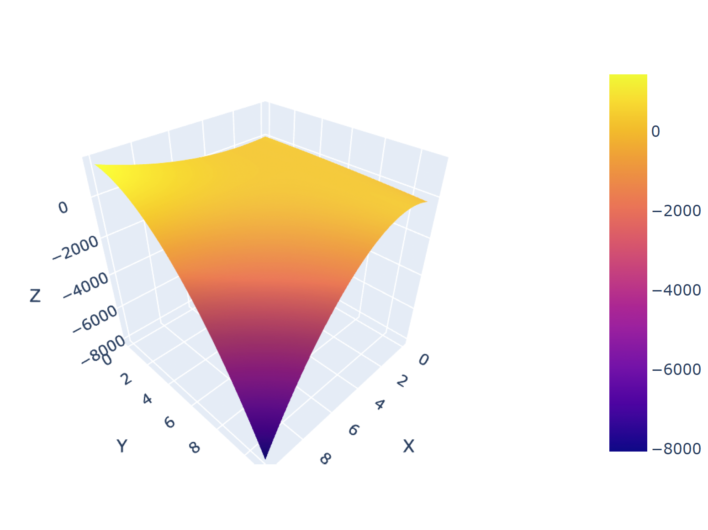

*Eduard Ursov*
# Продолжение локального экстремума
Решим еще одну задачу для тренировки.

## Задание 20
Найдите точки локальных экстремумов функции $f(x; y) = 3x^2 + y^2 -2x + 12y - 8\ln{x} - 14\ln{y}-1$ и определите их вид.
1. Находим частные производные функции $f(x;y)$ и приравниваем их к нулю:
$$
\begin{align}
\frac{\partial f(x,y)}{\partial x} = 6x - 2 - \frac{8}{x} = 0, \\
\frac{\partial f(x,y)}{\partial y} = 2y + 12 - \frac{14}{y} = 0.
\end{align}
$$
2. Решаем получившуюся систему уравнений:
$$
\begin{align}
6x^2 - 2x - 8 = 0, \rightarrow x = \frac{4}{3};x= -1. \\ 
2y^2 + 12y - 14 = 0. \rightarrow y = -7; y = 1.
\end{align}
$$
Отрицательные решения не принадлежат области определения, так как у нас в функции есть логарифм!
3. Итого у нас имеется 1 точка возможного экстремума: $A(\frac{4}{3},1)$.
4. Находим вторые производные функции $f(x;y)$:
$$
\begin{align}
\frac{\partial^2 f(x,y)}{\partial x^2} = 6 + \frac{8}{x^2}, \\
\frac{\partial^2 f(x,y)}{\partial y^2} = 2 + \frac{14}{y^2}, \\
\frac{\partial^2 f(x,y)}{\partial x \partial y} = 0.
\end{align}
$$
5. Исследуем точку возможного экстремума:
- точка $A(\frac{4}{3},1)$:
$$
\begin{align}
a_{11} = \frac{\partial^2 f}{\partial x^2}(B) = 6 + 9/2 = 21/2 >0, \\
a_{22} = \frac{\partial^2 f}{\partial y^2}(A) = 2 + 14/1 = 16 > 0, \\
a_{12} = \frac{\partial^2 f}{\partial x \partial y}(A) = 0.
\end{align}
$$
$$
D = a_{11}a_{22} > 0, a_{11} > 0 \Rightarrow B(\frac{4}{3},1) -\text{локальный минимум}.
$$

Задача решена. Ответ: точка $B(\frac{4}{3},1)$ является локальным минимумом функции $f(x;y)$.

# Наибольшее и наименьшее значение функций 

Тут лучше сразу начать решать задачи.

## Задание 27
Нaйдите нaибольшее и нaименьшее знaчения функции $f(x; y) = (x^2 - 3x + 2)(- y^2 - y + 20)$ нa прямоугольнике, огрaниченном линиями $x = 0, x = 10, y = 0, y = 11$.

Идея следующая. Нас будут интересовать значения функции ТОЛЬКО на границах прямоугольника и в экстремумах внутри прямоугольника. Сначала мы найдем точки возможного экстремума и отберем те, которые находятся внутри прямоугольника. Потом отыщем среди них экстремумы и найдем значения функции в экстремумах. Потом рассмотрим, как ведет себя функция на границах. На каждой границе мы попытаемся найти точки экстремума  и в них значения функции. Если на какой-то границе точки экстремума находятся вне границы, мы найдем значения функций в ребрах прямоугольника. В итоге у нас будет массив различных точек, среди которых мы будем искать точки, в которых функция принимает наибольшее и наименьшее значения.

Ответ мы можем угадать, если нарисуем график функции внутри этого прямоугольника:

Видно, что наибольшее и наименьшее значения функций находятся в ребрах прямоугольника, а, значит, нас ждет целая плеяда напрасных вычислений :С

1. Находим частные производные функции $f(x;y)$ и приравниваем их к нулю:
$$
\begin{align}
\frac{\partial f(x,y)}{\partial x} = (2x - 3)(-y^2 - y + 20) = 0, \\
\frac{\partial f(x,y)}{\partial y} = (x^2 - 3x + 2)(-2y - 1) = 0.
\end{align}
$$
2. Решаем получившуюся систему уравнений:
$$
\begin{align}
-(2x - 3)(y^2 + y - 20) = 0 \rightarrow (2x - 3)(y + 5)(y - 4) = 0, \\ 
(x^2 - 3x + 2)(-2y - 1) = 0 \rightarrow (x - 2)(x - 1)(-2y - 1) = 0. 
\end{align}
$$
Занулим первое уравнение. Есть несколько вариантов:
- $x = 3/2$. Тогда второе уравнение зануляется только при $y = -1/2$. Получаем точку $A(3/2, -1/2)$. Точка не входит в прямоугольник, поэтому ее не рассматриваем.
- $y = -5$. Тогда второе уравнение зануляется только при $x =1$ и $x=2$. Получаем две точки $B(1,-5), C(2,-5)$. Эти точки так же не входят прямоугольник.
- $y = 4$. Тогда второе уравнение зануляется только при $x =1$ и $x=2$. Получаем две точки $D(1,4), E(2,4)$. Эти точки входят в прямоугольник, и мы их будем рассматривать.
4. Находим вторые производные функции $f(x;y)$:
$$
\begin{align}
\frac{\partial^2 f(x,y)}{\partial x^2} = 2(-y^2 - y + 20), \\
\frac{\partial^2 f(x,y)}{\partial y^2} = -2(x^2 - 3x + 2), \\
\frac{\partial^2 f(x,y)}{\partial x \partial y} = (2x - 3)(-2y - 1).
\end{align}
$$
5. Исследуем точки возможного экстремума:
- точка $D(1,4)$:
$$
\begin{align}
a_{11} = \frac{\partial^2 f}{\partial x^2}(D) = 2(-16 - 4 + 20) = 0, \\
a_{22} = \frac{\partial^2 f}{\partial y^2}(D) = -2(1 - 3 + 2) = 0, \\
a_{12} = \frac{\partial^2 f}{\partial x \partial y}(D) = -1\cdot(-9)=9.
\end{align}
$$
$$
D = -a_{12}^2 < 0 \Rightarrow D(1,4) -\text{не является локальным экстремумом}.
$$
- точка $E(2,4)$:
$$
\begin{align}
a_{11} = \frac{\partial^2 f}{\partial x^2}(D) = 2(-16 - 4 + 20) = 0, \\
a_{22} = \frac{\partial^2 f}{\partial y^2}(D) = -2(4 - 6 + 2) = 0, \\
a_{12} = \frac{\partial^2 f}{\partial x \partial y}(D) = 1\cdot(-9)= -9.
\end{align}
$$
$$
D = -a_{12}^2 < 0 \Rightarrow E(2,4) -\text{не является локальным экстремумом}.
$$
6. Теперь рассмотрим границы прямоугольника.
	1. Начнем с нижней стороны прямоугольника $y = 0, 0 \le x \le 10$. А значит рассмотрим функцию $f(x;0) = 20 \cdot (x^2 - 3x + 2)$. Мы получили функцию одной переменной. Найдем экстремум этой функции и посмотрим, какие значения функция принимает на границах области. Перед нами парабола с ветвями вниз, следовательно она имеет минимум в точке $x =3/2$. Получаем следующее: на этой границе функция имеет минимальное значение $f(3/2;0) = 20\cdot(9/4 - 9/2+2)=-5$ и максимальное значение на границе: $f(10;0) = 20\cdot72=1440$. Запомнили эти значения.
	2. Рассмотрим верхнюю сторону прямоугольника $y = 11, 0 \le x \le 10$. А значит рассмотрим функцию $f(x;11) = -112 \cdot (x^2 - 3x + 2)$. Перед нами парабола с ветвями вверх, а значит она имеет максимум в точке $x=3/2$. Получаем следующее: на этой границе функция имеет максимальное значение $f(3/2;11) = -112 \cdot(9/4 - 9/2+2)=28$ и минимальное значение на границе: $f(10;11) = -112\cdot 72 = -8064$. Запомнили эти значения.
	3. Рассмотрим левую сторону прямоугольника $x = 0, 0 \le y \le 11$. А значит рассмотрим функцию $f(0;y) = 2(-y^2 - y + 20)$.  Перед нами парабола с ветвями вверх, а значит она имеет максимум в точке $y=-1/2$. Эта точка находится вне стороны прямоугольника, она нам не интереса. Минимальное значение функции на этой стороне: $f(0;11) = 2\cdot (-112) = -224$. Максимальное значение функции на этой стороне: $f(0;0) = 40$. Запомнили.
	4.  Рассмотрим правую сторону прямоугольника $x = 10, 0 \le y \le 11$. А значит рассмотрим функцию $f(10;y) = 72\cdot (-y^2 - y + 20)$.  Перед нами парабола с ветвями вверх, а значит она имеет максимум в точке $y=-1/2$. Эта точка находится вне стороны прямоугольника, она нам не интереса. Минимальное значение функции на этой стороне: $f(10;11) = -8064$. Максимальное значение функции на этой стороне: $f(10;0) = 1440$. Запомнили.
7. Теперь посмотрим, что у нас получилось. Максимальное значение функции находится в точке $(10,0)$: $f(10;0) = 1440$. Минимальное значение функции находится в точке $(10,11)$: $f(10;11) = -8064$.

Задача решена. Ответ: Максимальное значение функции находится в точке $(10,0)$: $f(10;0) = 1440$. Минимальное значение функции находится в точке $(10,11)$: $f(10;11) = -8064$. Это совпадает с нашей картинкой, которую мы нарисовали в начале задачи.

## Множество значений значений функции на множестве

## Задание 27
Нaйдите множеcтво знaчений функции $f(x; y) = 4x^2 + 6xy + 2y^2 + 4x - 2y + 3$ нa треугольнике, ограниченном линиями $x=0,y=0,6x+y=24$.

Задача такая же. Делаем то же самое: пытаемся найти экстремумы и смотрим значение функции на границе множества.

1. Находим частные производные функции $f(x;y)$ и приравниваем их к нулю:
$$
\begin{align}
\frac{\partial f(x,y)}{\partial x} = 8x + 6y + 4 = 0, \\
\frac{\partial f(x,y)}{\partial y} = 6x + 4y - 2 = 0.
\end{align}
$$
2. Решаем получившуюся систему уравнений:
$$
\begin{align}
x = -8, \\
y = -10.
\end{align}
$$
Точка не находится внутри заданного треугольника, она нам не интересна.

3. Теперь рассмотрим границы треугольника. Ребра находятся в точках $(0,0), (0,24),(4,0)$
	1. Рассмотрим первую сторону $y=0, 0 \le x \le 4$. Рассмотрим функцию $f(x;0) = 4x^2 + 4x + 3$. Это парабола, ветви вверх. Минимум находится в точке $x= -1/2$. Эта точка не входит в треугольник, она нам не интересна. Рассмотрим значения функций в ребрах: $f(0;0) = 3, f(4;0) = 83$. Запомнили.
	2. Рассмотрим вторую сторону $x=0, 0 \le y \le 24$.  $f(0;y) = 2y^2 - 2y + 3$. Парабола с минимумом в точке $y = 1/2$, $f(0,1/2) = 1/2 - 1 + 3 = 5/2$. Максимальное значение функции на ребре $f(0;24) = 2\cdot24^2 -2\cdot 24 + 3 = 1107$.
	3. Рассмотрим последнюю сторону $6x + y = 24$. Функция выглядит так: 
	$$
	\begin{align}
	f(x, 24 - 6x) = 4x^2 + 6x(24-6x) + 2(24 - 6x)^2  + 4x - 2(24-6x) + 3 = \\ 4x^2 +144x - 36x^2 +  1152 - 576x + 72x^2 + 4x - 48 + 12x + 3 = 40x^2 - 416x + 1107.
	\end{align}$$
	Миниум находится в точке $x = 26/5$: $f(26/5; 24 - 6x =-36/5) = 127/5 = 25.4$
4. Теперь посмотрим, что у нас получилось. Максимальное значение функции находится в точке $(0,24)$: $f(0;24) = 1107$. Минимальное значение функции находится в точке $(0,1/2)$: $f(0;1/2) = 5/2$. Множество значений функции в треугольнике $y \in [5/2,1107]$.

Задача решена. Ответ: Множество значений функции в треугольнике $y \in [5/2,1107]$.

## Полезная литература и ссылки
1. [Ссылка на код с визуализацией](https://nbviewer.org/github/eduard322/FA_calc/blob/main/code/Sem_3.ipynb)
2. [Mathprofi](http://mathprofi.ru/extremumy_funkcij_dvuh_i_treh_peremennyh.html)
3. _Математический анализ в вопросах и задачах_, Бутузов В.Ф., Крутицкая Н.Ч., Медведев Г.Н., Шишкин А.А.

